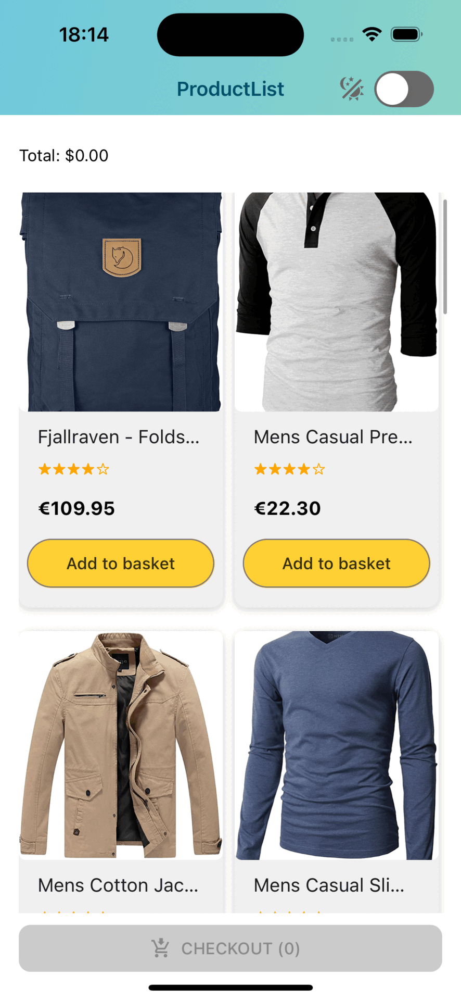
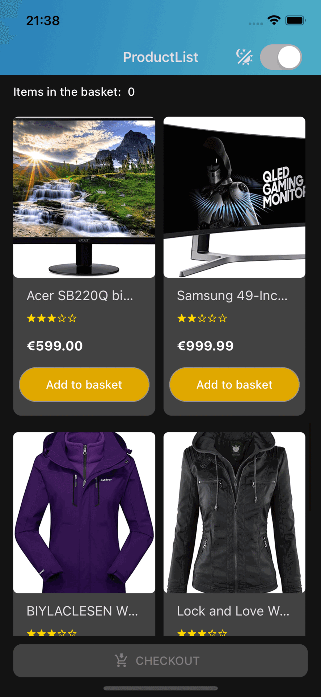
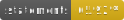
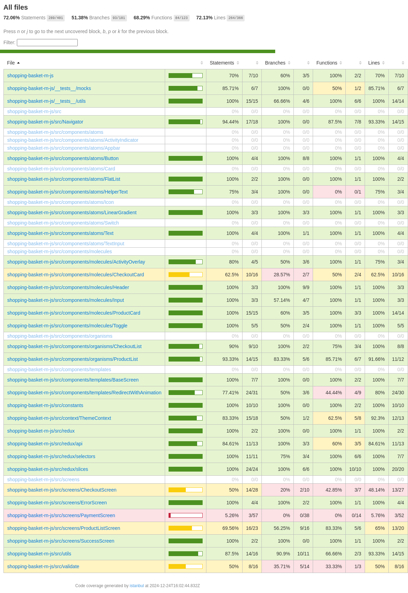

# Shopping Basket

A React Native sample e-commerce app designed to showcase various modern development practices, including clean code
principles, state management, testing strategies, and user interface design.

---

## 🎥 Demo

Watch the app in action:

[](https://youtu.be/bg9vKTF9HW8)

Click the image above to view the demo video.

---

## 🖼️ Visuals

### Light Theme



### Dark Theme



---

## Status Legend

\- ✅ DONE

\- 🟢 IN PROGRESS

\- 🟡 TODO

---

## 🚀 Features

### **Basic Requirements**

1. **Product List View**

   - ✅ Display products with their details.
   - ✅ Allow adding items to the basket.
   - ✅ Limit product quantity to 5 per item.
   - ✅ Disable the add button if the limit is reached and show a message to the user on the product card.
   - ✅ Display total items in the basket.
   - ✅ Navigation to Basket Checkout View if there is at least one item in the basket.
   - ✅ Show a message if there are no products available.

2. **Basket Checkout View**

   - ✅ Show items in the basket with their quantities and prices.
   - ✅ Calculate and display the total price.
   - ✅ Add a promo code field to apply discounts. (Available promo codes: `A` + `XX` (two digits), i.e., `A10` %10,
     `A80` %80, and so on.)
   - ✅ Validate promo codes, make an API call, and update the total.
   - ✅ Show a message if the basket is empty.
   - ✅ Show a message if the promo code is invalid.
   - ✅ Show a message if the promo code is applied successfully.
   - ✅ Allow removing items from the basket.
   - ✅ Navigation to Payment View if there is at least one item in the basket.

3. **Payment View**

   - ✅ Payment form with credit card validations and error messages.
   - ✅ Navigate to Success Screen if the payment is successful.
   - ✅ Navigate to Error Screen if the payment fails.

4. **Payment Result Views**

   - ✅ Success Screen with a progress bar animation.
   - ✅ Error Screen with an error message and a progress bar animation.

5. **UX/UI**

   - ✅ Light and dark themes.
   - ✅ Inspired by the Amazon App. (for light theme)
   - ✅ Components structure designed with Atomic Web Design principles for atoms, molecules, organisms, templates, and
     screens.

### **Code Requirements**

- ✅ UI components should follow the Atomic Design structure: This means breaking components into smaller, reusable
  parts (`atoms`, `molecules`, etc.) and structuring them accordingly.
- ✅ UI elements should be extended in the `components/atoms` folder: All base components should be created in the
  `atoms` directory, and then these atomic components should be reused throughout the application.
- ✅ Test and style files should be in the same folder as the component.
- ✅ Avoid inline styles.
- ✅ Use functional components.
- ✅ Define colors, fonts, spacing, and other constants in the theme file.
- ✅ Import all UI elements from the components folder, starting with components/atoms to maintain a centralized and
  extensible structure.
- ✅ Prevent unnecessary re-renders using `useMemo` and `useCallback` (verified with "why did you render").
- ✅ Enforce lint and test error-free commits (implemented with Husky and lint-staged).
- ✅ Enforce valid commit messages (implemented with Commitlint).
- ✅ Prevent pushing code with test coverage below 40% (implemented with Jest and Husky).
- ✅ Run only necessary tests with `--findRelatedTests` flag with husky pre-commit hook.
- ✅ Use aliases for paths in imports.
- ✅ Generate automated test coverage reports and badges.
- 🟡 Aim for a test coverage threshold of 80%.

---

## 📂 Folder Structure

Here is the folder structure for key parts of the project:

### Root-Level Folders

```plaintext
├── assets/             # Images, fonts, and static assets
├── badges/             # Test coverage badges
├── src/                # Application source code
├── __tests__/          # Test files
│   ├── mocks/          # Mock data for tests
│   └── utils/          # Test utility functions
└── ...
```

### `src`

```plaintext
src/
├── components/         # Reusable UI components
│   ├── atoms/          # Small building blocks of UI
│   │   ├── Button/
│   │   │   ├── index.js
│   │   │   ├── Button.style.js
│   │   │   └── Button.test.js
│   │   ├── index.js   # Exports for atoms
│   │   └── ...
│   ├── molecules/      # Combined components (atoms + logic)
│   │   ├── index.js   # Exports for molecules
│       └── ...
│   ├── organisms/      # Complex reusable components
│   │   ├── index.js   # Exports for organisms
│       └── ...
│   └── templates/      # Reusable layout components
│       ├── index.js   # Exports for templates
│       └── ...
├── screens/            # Application screens
│   ├── ProductListScreen/
│   │   ├── index.js
│   │   ├── ProductListScreen.style.js
│   │   └── ProductListScreen.test.js
│   ├── SuccessScreen/
│   │   ├── index.js
│   │   ├── SuccessScreen.style.js
│   │   └── SuccessScreen.test.js
│   ├── index.js       # Exports for screens
│   └── ...
├── redux/              # State management logic
├── constants/          # Application constants (e.g., themes, URLs)
│   ├── index.js        # Exports for constants
├── utils/              # Helper functions and utilities
├── context/            # Context API files
├── validate/           # Validation utilities
│   ├── index.js        # Exports for validate
└── ...
```

---

## 🛠️ Tech Stack

- **React Native**: Core development framework.
- **Expo**: Quick setup and development environment.
- **State Management**: Redux Toolkit.
- **API Calls**: `fetch`.
- **Form Management**: `react-hook-form` with validation.
- **Testing**: Jest, `@testing-library/react-native` , `mock-service-worker` .
- **UI Components**: React Native Paper, custom components.
- **Performance Optimization**: `useCallback`, `useMemo`.
- **Code Quality**: ESLint, Prettier, Husky, Commitlint.
- **Animation**: `Animated`.

---

## 📦 Installation

1. Clone the repository:

   ```bash
   git clone https://github.com/abdullahbayram/shopping-basket-rn-js.git
   cd shopping-basket
   ```

2. Install dependencies:

   ```bash
   npm install
   ```

3. Start the app:

   ```bash
   npx expo start
   ```

---

## 🧪 Testing

To ensure the robustness of the application, the following testing strategies and practices are implemented:

- **🟢 Unit Testing**: All components and utility functions are covered with unit tests to ensure correctness of
  individual units of code.
- **🟡 Integration Testing**: Critical workflows, such as adding items to the basket, applying promo codes, and
  navigating between screens, are tested to validate seamless interaction between components.
- **🟡 Mock API Testing**: Using `mock-service-worker`, API calls are simulated to test application behavior under
  various response scenarios.
- **✅ Code Coverage**: Coverage reports are generated with Jest, with a minimum threshold enforced to maintain code
  quality.

To run the tests:

```bash
npm test
```

Run the tests with coverage:

```bash
npm test -- --coverage
```

Test coverage reports are automatically generated in the `coverage` directory for review.

---

## Test Coverage

  




## 🌟 Contributing

Contributions are welcome! Please follow these steps:

1. Fork the repository.
2. Create a new branch (`git checkout -b feature/new-feature`).
3. Commit your changes (`git commit -m 'Add some feature'`).
4. Push to the branch (`git push origin feature/new-feature`).
5. Open a pull request.

Make sure your code adheres to the project’s linting and testing standards. Additionally, provide clear documentation
for any new features.

---

## 📄 License

This project is licensed under the MIT License - see the [LICENSE](LICENSE) file for details.

---

## 💬 Contact

Feel free to reach out via email at [info@abayram.dev](mailto:info@abayram.dev)&#x20;
